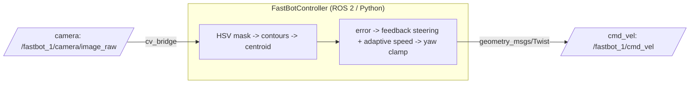

# F1 Autonomous Racing Robot (ROS 2 • Python • OpenCV • Gazebo)

Vision-driven controller that makes the **yellow Fastbot** complete a full lap in simulation.  
**Result:** best lap **110 s** (consistent, repeatable finishes).
**Video Link: https://youtu.be/lC52FBxfscU**
**ROS + Gazebo Cloud Environment (Docker-based): https://app.theconstruct.ai/l/6c3e7d72/**

---

## Table of Contents
- [What it does](#-what-it-does)
- [System overview](#-system-overview)
- [Tested environment](#-tested-environment)
- [Topics](#-topics)
- [Project structure](#-project-structure)
- [Install & build](#-install--build)
- [Run](#-run)
- [How it works](#-how-it-works)
- [Results](#-results)
- [Tuning guide](#-tuning-guide)
- [Troubleshooting](#-troubleshooting)
- [Roadmap](#-roadmap)


---

## ✨ What it does
- **Perception (OpenCV):** Real-time line detection using HSV segmentation → contour/centroid tracking with ROI focus and temporal smoothing to stay locked on the track.
- **Control (ROS 2):** Feedback steering with adaptive forward speed and stability guards (saturation and loss-of-line recovery) to corner confidently and avoid spin-in-place.
- **Live Debug:** On-image overlays (contour, centroid, text) to accelerate tuning and diagnosis.

---

## 🧱 System overview


---

## 🖥️ Tested environment
- **ROS 2:** Humble (other recent distros should work with minor tweaks)
- **Simulator:** Gazebo (contest world)
- **OS:** Ubuntu 22.04
- **Language & Libraries:** Python 3, `rclpy`, `cv_bridge`, `OpenCV`

---

## 🔌 Topics
- **Subscribe:** `/fastbot_1/camera/image_raw` (`sensor_msgs/Image`)
- **Publish:** `/fastbot_1/cmd_vel` (`geometry_msgs/Twist`)

> Use ROS 2 remapping if your sim uses different names (see **Run**).

---

## 📦 Project structure
```
follow_track/
├─ package.xml
├─ setup.py
├─ resource/follow_track
├─ follow_track/
│  ├─ __init__.py
│  └─ follow_node.py        # FastBotController (vision + control)
└─ launch/
   └─ follow_track.launch.py
```

**Minimal launch file** — `launch/follow_track.launch.py`
```python
from launch import LaunchDescription
from launch_ros.actions import Node

def generate_launch_description():
    return LaunchDescription([
        Node(
            package='follow_track',
            executable='follow_node',
            name='fastbot_controller',
            output='screen',
            remappings=[
                ('/fastbot_1/camera/image_raw', '/fastbot_1/camera/image_raw'),
                ('/fastbot_1/cmd_vel', '/fastbot_1/cmd_vel'),
            ],
        )
    ])
```

---

## ⚙️ Install & build
1) Create a workspace and clone:
```bash
mkdir -p ~/fastbot_ws/src && cd ~/fastbot_ws/src
git clone https://github.com/<your-username>/fastbot-lap-racer.git follow_track
```

2) Install dependencies:
```bash
sudo apt update
rosdep install --from-paths . --ignore-src -r -y
```

3) Build:
```bash
cd ~/fastbot_ws
colcon build
source install/setup.bash
```

---

## ▶️ Run

### Via launch (recommended)
```bash
ros2 launch follow_track follow_track.launch.py
```

### Run the node directly
```bash
ros2 run follow_track follow_node
```

### Remap topics (if your sim uses different names)
```bash
ros2 run follow_track follow_node   --ros-args   -r /fastbot_1/camera/image_raw:=/camera/image_raw   -r /fastbot_1/cmd_vel:=/cmd_vel
```

> Tip (bigger debug window):  
> ```python
> cv2.namedWindow("Track Follower", cv2.WINDOW_NORMAL)
> cv2.imshow("Track Follower", image)
> ```

---

## 🧪 How it works
1. **Image pipeline:** Resize frame → convert BGR→HSV → apply multi-range mask → `findContours` → select largest blob → compute centroid (cx, cy).
2. **Error signal:** `error_x = cx − image_center_x` (cross-track error).
3. **Control:** Feedback steering from the error and its trend; clamp yaw to avoid saturation; modulate forward speed based on error magnitude (slow on bends, fast on straights).
4. **Safety:** If no valid contour is found, the robot stops and waits to reacquire the line.

---

## 🎯 Results
- **Best full autonomous lap:** **110 s** in the contest Gazebo world.
- **Consistency:** Reliable finishes without spin-in-place on sharp bends.
- **Faster tuning:** Live overlays and a running max-error printout guide quick adjustments.

---

## 🔧 Tuning guide
- **Perception robustness:**  
  - Adjust HSV ranges to your lighting; add light morphology (open/close) if the mask is noisy.  
  - Crop the region of interest to focus near the robot’s wheels and reduce false positives.
- **Cornering:**  
  - Increase steering responsiveness gradually, and ensure yaw clamp prevents oscillation.  
  - Use stronger speed reduction for large errors; accelerate back once the error drops.
- **Recovery:**  
  - Confirm the node halts on loss of line and resumes as soon as the line reappears.  
  - Log max cross-track error to see whether you’re over- or under-steering.

---

## 🛠️ Troubleshooting
- **No image / black window:**  
  Verify the camera topic:  
  ```bash
  ros2 topic echo /fastbot_1/camera/image_raw -n 1
  ```
  Remap if needed.
- **Robot spins or beelines into walls:**  
  Mask may be picking background noise—tighten HSV and ROI; reduce forward speed on large errors.
- **Headless / remote runs:**  
  Disable OpenCV windows or run with `xvfb-run`.

---

## 🚧 Roadmap
- Optional **pure-pursuit** geometry for smoother arcs  
- **LiDAR gate** to slow down near unexpected obstacles  
- Adaptive HSV thresholding from image histogram

---

### Quick start (copy/paste)
```bash
# build
mkdir -p ~/fastbot_ws/src && cd ~/fastbot_ws/src
git clone https://github.com/<your-username>/fastbot-lap-racer.git follow_track
cd ..
rosdep install --from-paths src --ignore-src -r -y
colcon build
source install/setup.bash

# run (default topics)
ros2 run follow_track follow_node
```
